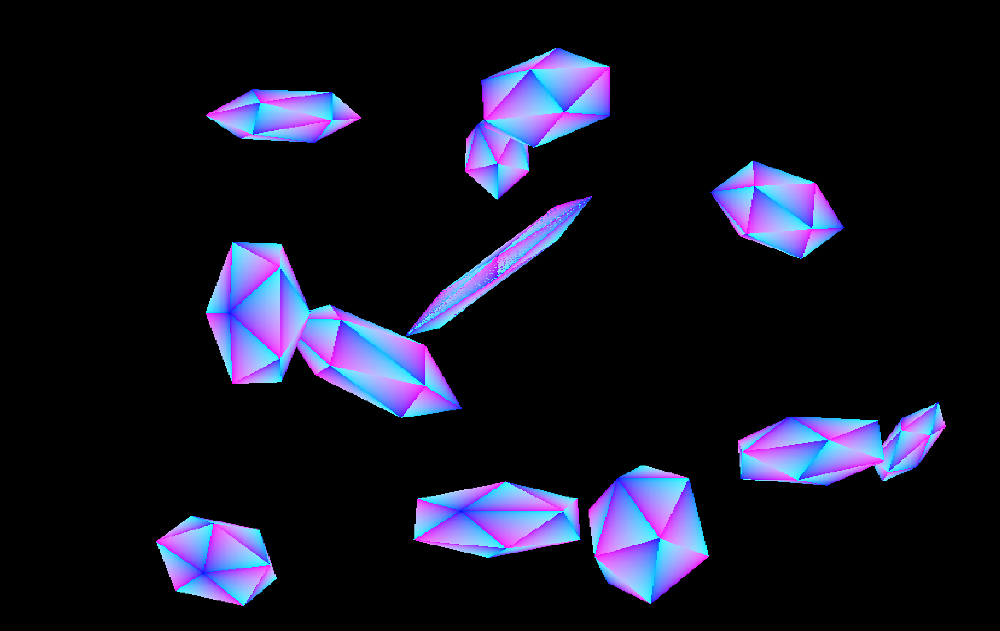
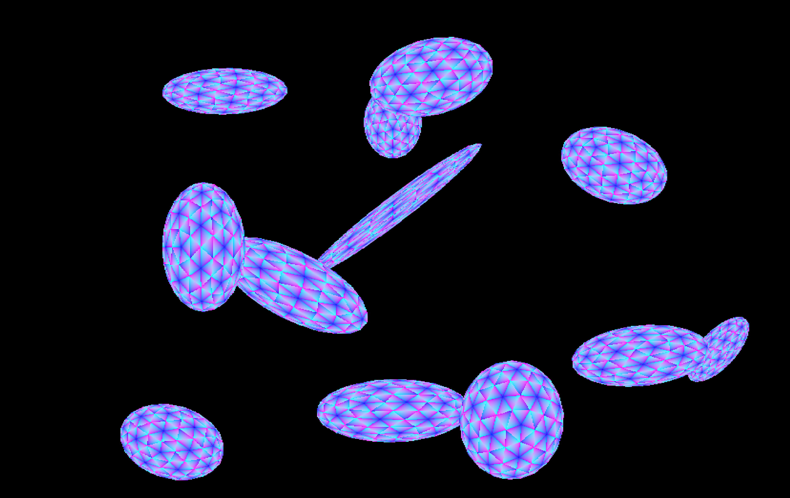

# Ray_tracing_optix

This is a simple ray tracing project using NVIDIA OptiX. It is based on the OptiX SDK 8.0.0.
Works the best with nvidia gpus with Ray Tracing Cores (RTX GPUs).

## Build

Cuda Version 11.8
    
```
mkdir build
cd build
cmake ../SDK
make
```

## Run

```
./bin/optix_icosahedron
```

## Current Example

The current example is a simple ray tracing project that renders icosahedron with a simple material. The unit icosahedron is transformed using gaussian parameters to create more complex shapes. Loop subdivision is used to create a smooth surface which replicates an ellipsoid. The current shading model is a simple barycentric shading model.

Current version uses separate hit groups for each geometry thus having separate Shader Binding Table entries for each geometry. This is not the most efficient way to do it but it is simple and easy to understand. But for the applications like ray tracing for Gaussian Particle Splatting, it is better to keep all geometries separate and use a single hit group for all geometries.

## Future Work

Implement Ray tracing for Gaussian Particle Splatting. Calculate transmission Probabilies along the ray and accumulate the color at the end of the ray. This will be used to render the Gaussian Particle Splatting.




